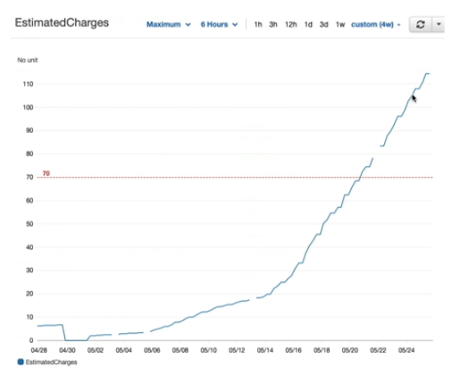

# Billing Alarms in CloudWatch

- Billing data metric is stored in **CloudWatch us-east-1**
- Billing data are for **overall worldwide AWS costs**
- It's for actual cost, not for projected costs
- Intended as simple alarm (not as powerful as AWS Budgets)

