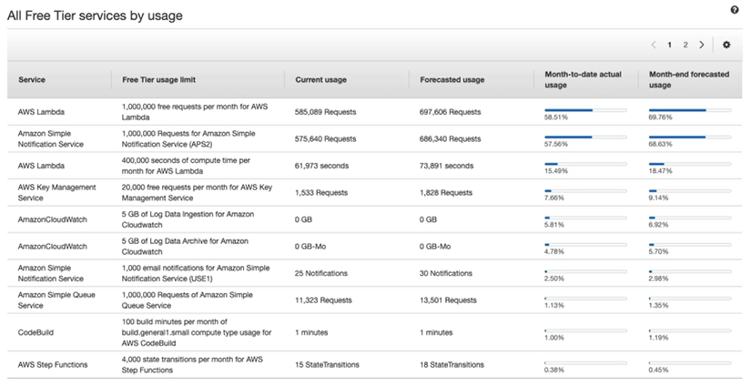
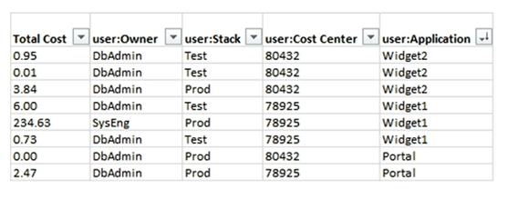

# AWS Billing Dashboard

## AWS Free Tier Dashboard

## Cost Allocation Tags

- Use **cost allocation tags** to track your AWS costs on a detailed level
- **AWS generated tags**
    - Automatically applied to the resource you create
    - Starts with prefix **aws:** (e.g. aws:createdBy)
- **User-defined tags**
    - Defined by the user
    - Starts with prefix **user:**
- Tags can be used to create **Resouce Groups**
    - Create, maintain, and view a collection of resources that share common tags
    - Manage these tags using the Tag Editor
- Free naming
    - Common tags: Name, Environment, Team, etc.

