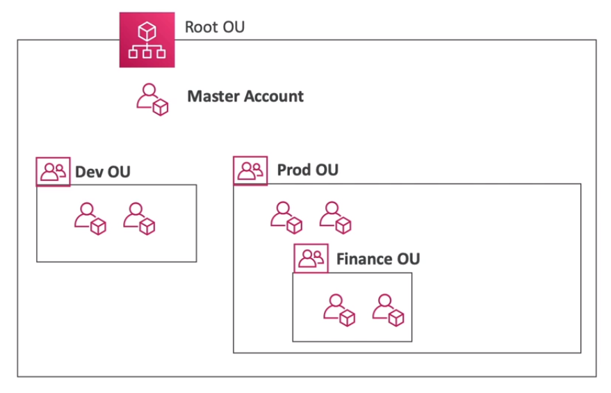

# AWS Organizations - Consolidated Billing

- When enabled, provides you with:
    - **Combined Usage** (combine the usage across all AWS accounts in the AWS Organization)
        - share the volume pricing
        - share reserved instances 
        - sahre saving plans discounts
    - **One Bill** get one bill for all AWS Accounts in the AWS Organization

