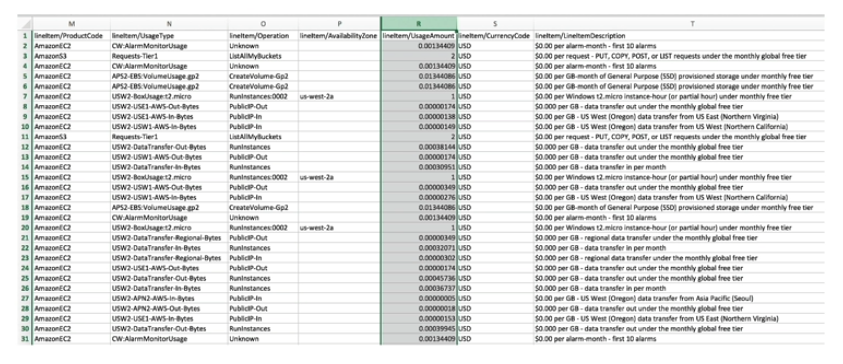

# Cost and Usage Reports

- Dive deeper into your AWS costs and usage
- Contains **the most comprehesive set of AWS cost and usage data available**
- Includes additional metadata about AWS services, pricing, and reservations
- Lists AWS usage for each service category used by an account and its IAM users in hourly or daily line items, as well as any tags that you have activated for cost allocation purposes
- Can be integrated with Athena, Redshift or QuickSight

