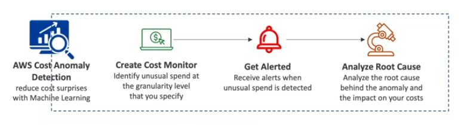

# AWS Cost Anomaly Detection

- Continuously **monitor your cost and usage** using ML to detect unusual spends
- It learns your unique, historic spend patterns to detect one-time cost spike and/or continuous cost increases (you don't need to define thresholds)
- Monitor AWS services, member accounts, cost allocation tags, or cost categories
- Sends you the anomaly detection report with root-cause analysis
- Get notified with individual alerts or daily/weekly summary (using SNS)

