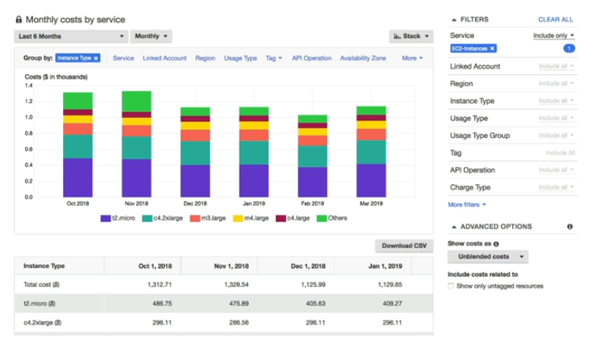
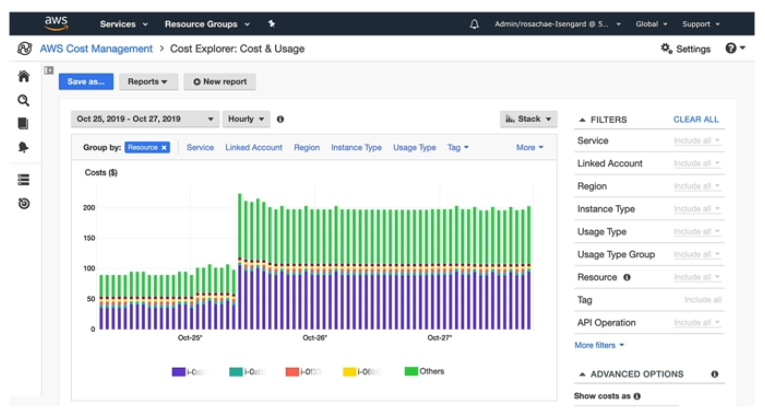
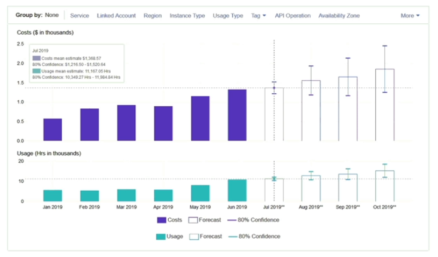

# Cost Explorer

- Visualize, understand, and manage your AWS costs and usage over time
- Create **custom reports** that analyze cost and usage data
- Analyze your **data at a high level**
    - e.g. total costs and usage across all accounts
    - e.g. monthly, hourly, resource level granularity
- Choose an optimal **Saving Plan** (to lower prices on your bill)
- **Forecast usage up to 12 months based on previous usage**

## Cost Explorer - Monthly Cost

## Cost Explorer - Hourly & Resource Level

## Cost Explorer - Forecast Usage

