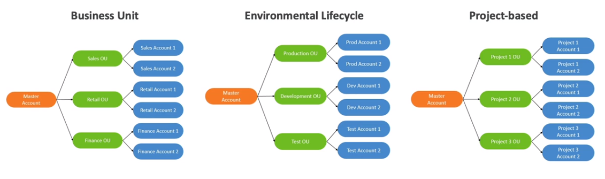

# AWS Organizations

- Global service
- Allows to manage **multiple AWS accounts**
- The main account is the **master account**
- Cost Benefits:
    - Consolidated billing accross all accounts - single payment method
    - Pricing benefits from aggregated usage (volume discount for EC2, S3, etc.)
    - Pooling of reserved EC2 instances for optimal savings
        - Note: only if Bob launches his instances **in the same AZ** where Alice purchased
- API is available to automate AWS account creation
- Restrict account privileges using **Service Control Policies (SCP)**

## Multi Account Strategies

- Create accounts:
    - per department
    - per cost center
    - per dev/test/prod
    - bases on regulatory restrictions (using SCP)
    - for better resource isolation (ex: VPC)
    - to have separate per-account service limits
    - isolated account for logging
- Multi Account vs One Account-Multi VPC
- Use tagging standards for billing purposes
- Enable CloudTrail on all accounts, send logs to central S3 account
- Send CloudWatch Logs to central logging account

## Organizational Units (OU) - Examples

## AWS Organization

## Service Control Policies (SCP)

- Whitelist/Blacklist IAM actions
- Applied at the **Organizational Unit or Account level**
- Does **not apply to the Master Account**
- SCP is applied to all the **Users and Roles** of the Account, including Root
- The SCP does not affect service-linked roles
    - Service-linked roles enable other AWS services to integrate with AWS Organizations and can't be restricted by SCPs
- **SCP must have an explicit Allow** (does not allow anything by default)
- Uses cases:
    - Restrict access to certain services (for example: can't use EMR)
    - Enforce PCI compliance by explicitily disabling services

## SCP Hierarchy 

