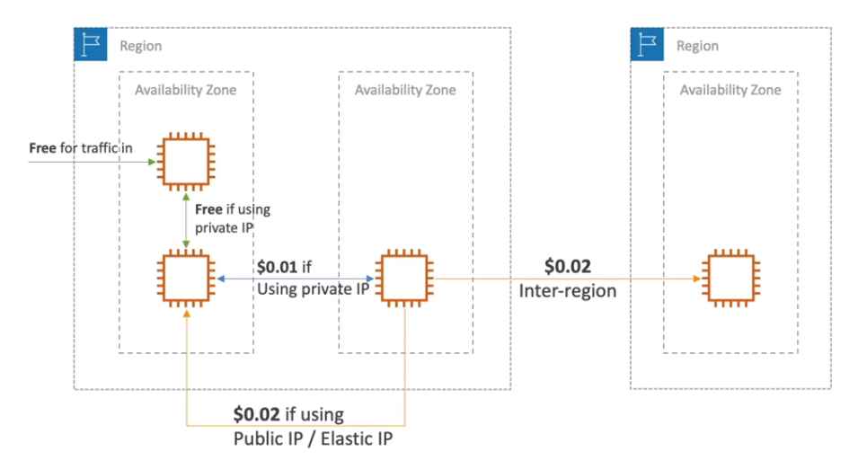

# Pricing Models in AWS

AWS ha 4 pricing models:
1. **Pay as you go**: pay for what you use, remain agile, responsive, meet scale demands
2. **Save when you reserve**: minimize risks, predictably manage budgets, comply with long-term requirements (e.g. EC2, RDS, ElastiCache, Redshift, DyanamoDB)  
3. **Pay less by using more**: volume-based discounts (e.g. S3)
4. **Pay less as AWS grows**

## Free services & Free Tier in AWS

- IAM
- VPC
- Consolidated Billing
- Elastic Beanstalk*
- CloduFormation*
- Auto Scaling Groups* 
- Free Tier

**You pay only for the resources created*

## Compute Pricing - EC2

- Only charged for what you use
- Number of instances
- Instance configuration
    - Physical capacity
    - Region
    - OS and software
    - Instance type
    - Instance size
- ELB running time and amount of data processed
- Detailed monitoring

## Compute Pricing - EC2 instances

- **On-demand instances**
    - Minimum of 60s
    - Pay per second (Linux/Windows) or per hour (other)
- **Reserved instances**
    - Up to 75% discount compare to On-demand on hourly rate
    - 1 or 3 years commitment
    - All upfront ($$), partial upfront ($), no upfront
- **Spot instances**
    - Up to 90% discount compared to On-demand on hourly rate
    - Bid for unused capacity
- **Dedicated host**
    - On-demand
    - Reservation for 1 or 3 years commitment
- **Saving plans** as an alternative to save on sustained usage

## Compute Pricing - Lambda & ECS

- Lambda
    - Pay per call
    - Pay per duration
- ECS
    - EC2 Launch Type Model: no additional fees, you pay for AWS resources stored and created in your application
- Fargate
    - Fargate Launch Type Model: pay for vCPU and memory resources allocated to your applications in your containers

# Storage Pricing - S3

- Storage class
    - S3 Standard
    - S3 Infrequent Access
    - S3 One-Zone Infrequent Access
    - S3 Intelligent Tiering
    - S3 Glacier
    - S3 Glacier Deep Archive
- Number and size of objects: price can be tiered (based on volume)
- Number and type of requests
- Data transfer out of the S3 region
- S3 Transfer Acceleration
- Lifecycle transitions
- Similar service: EFS (pay per use, has infrequent access & lifecycle rules)

## Storage Pricing - EBS

- Volume type (based on performance)
- Storage volume in GB per month **provisioned** (even if not utilized)
- IOPS
    - General Purpose SSD: included
    - Provisioned IOPS SSD: provisioned amount in IOPS
    - Magnetic: number of requests
- Snapshots
    - Added data cost per GB per month
- Data transfer
    - Outbound data transfer are tiered for volume discounts
    - Inbound is free

## Database pricing - RDS

- Per hour billing
- Database characteristics
    - Engine
    - Size
    - Memory class
- Purchase type
    - On-demand
    - Reserved instances (1 or 3 years) with required up-front
- Backup Storage: there is no additional charge for backup storage up to 100% of your total database storage for a region
- Additional storage (per GB per month)
- Number of input and output requests per month
- Deployment type (storage and I/O are variable)
    - Single AZ
    - Multiple AZs
- Data transfer:
    - Outbound data transfer are tiered for volume discount
    - Inbound is free

## Content Delivery Pricing - CloudFront

- Pricing is different across different geographic regions
- Aggregated for each edge location, then applied to you bill
- Data Transfer Out (volume discount)
- Number of HTTP/HTTPS requests

## Networking Costs in AWS per GB - Simplified

- Use Private IP instead of Public IP for good savings and better network performance
- Use same AZ for maximum savings (at the cost of high availability)

