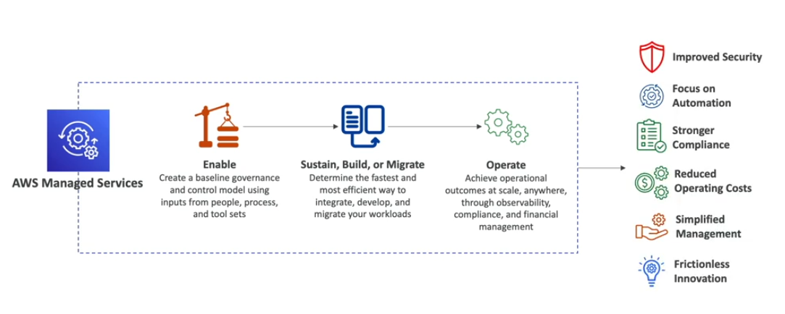

# AWS Managed Services (AMS)

- Provides infrastructure and application support on AWS
- **AMS offers a team of AWS experts** who manage and operate your infrastructure for security, reliability, and availability
- Helps organizations offload **routine management tasks** and focus on their business objectives
- Fully managed service, so AWS handles common activities such as change requests, monitoring, patch management, security, and backup services
- Implements best practices and maintains your AWS infrastructure to reduce your operational overhead and risk
- AMS business hours area 24/365

