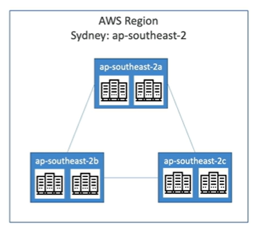

## AWS Cloud Overview

AWS Global Infrastructure:

- AWS Regions
- AWS Availability Zones
- AWS Data Center
- AWS Edge Locations / Point of Presence

## AWS Regions

A **region** is a cluster of data centers. 

How to choose an AWS Region ? Factors that may impact your choice:

- **Compliance** with data governance and legal requirements
- **Proximity** to customers to reduce latency
- **Available Services** within a region
- **Pricing** of the region

NOTE: most AWS Services are region-scoped. 

## AWS Availability Zones

AWS Regions consist of multiple, isolated, and physically separate **Availability Zones** within a geographic area (min 3, max 6).

Availability zone (AZ):
- one or more discrete data center with reduntant power, networking and connectivity
- separated from each others, so they are isolated from disasters
- connected with high bandwith ultra-low latency networking

Example:

Region: **ap-southeast-2** (Sidney)
- Availability Zone 1: **ap-southeast-2a**
- Availability Zone 2: **ap-southeast-2b**
- Availability Zone 3: **ap-southeast-2c**

## AWS Point of Presence

Amazon has 400+ Points of Presence in 90+ Cities across 40+ Countries.

Content is delivered to end user with lower latency.