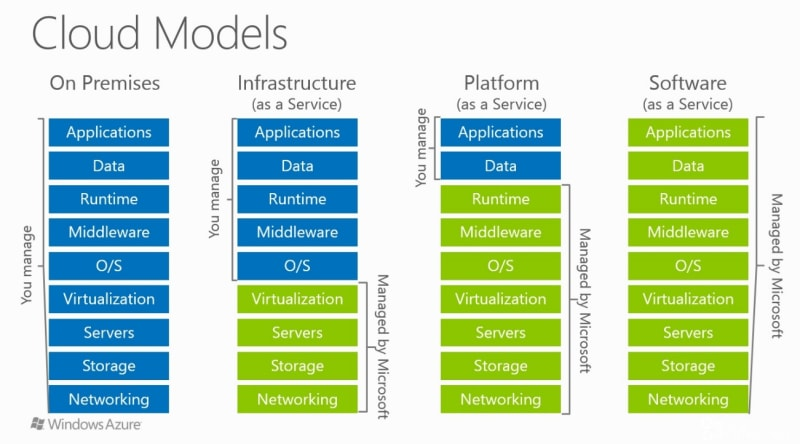

# Cloud Computing

Cloud Computing is the on-demand availability of computer system resources, especially data storage and computing power, without direct active management by the user.

Three kinds of cloud computing:

- **Private Cloud** (e.g. RackSpace)
    - cloud services used by a single organization
    - not exposed to the public
    - complete control
    - security for sensitive applications
    - meet specific business needs
- **Public Cloud** (e.g. Azure, Google, AWS)
    - cloud resources owned and operated by a third-party cloud service delivered over the Internet
- **Hybrid Cloud**
    - keep some servers on premises and extend some capabilities to the cloud
    - control over sensitive assets in your private infrastructure
    - flexibility and cost-effectiveness of the public cloud

Five characteristics of cloud computing:

1. On-demand self-service
2. Broad network access
3. Multi-tenancy and resource pooling
4. Rapid elasticity and scalability
5. Measured service

Six advantages of cloud computing:

1. Trade CAPEX for OPEX
2. Benefit from massive economies of scale
3. Stop guessing capacity
4. Increase speed and agility
5. Stop spending money running and mantaining data centers
6. Go global in minutes

Pricing fundamentals of cloud computing:

- Compute: pay for compute time
- Storage: pay for data stored
- Network: pay for data transfer **out** of the cloud

## Types of cloud computing

- **Infrasctructure as a Service (IaaS)**
    - e.g. EC2
- **Platform as a Service (PaaS)**
    - e.g. Elastic Beanstalk
- **Software as a Service (SaaS)**
    - e.g. Rekognition for Machine Learning

