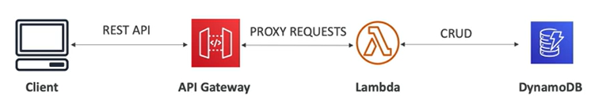

# API Gateway

- Fully **managed service** for developers to easily create, publish, maintain, monitor and secure API
- Serverless and scalable
- Supports RESTful APIs and WebSockets APIs (for real-time streaming of data)
- Supports for security, user authentication, API throttling, API keys, monitoring, etc.

## Example: Building a Serverless API

