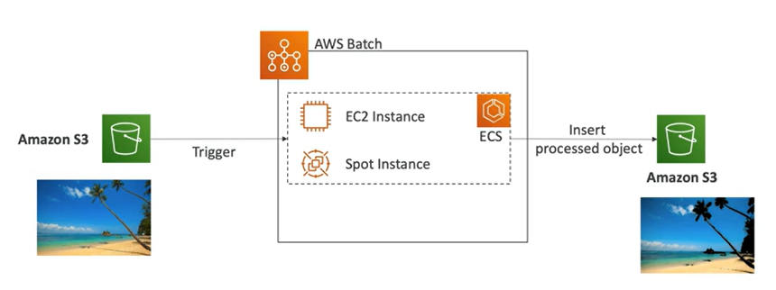

# Batch

- Fully managed batch processing at any scale
- Efficiently run 100K of computing batch jobs
- A batch job has a start and an end (opposed to continuos)
- AWS Batch will dynamically launch **EC2 instances** or **Spot instances** to accomodate with the load
- AWS Batch provisions the right amount of compute/memory to deal with the batch queue
- You submit or schedule batch jobs and AWS Batch does the rest
- **AWS Batch jobs are defined as Docker images and run on ECS**
- Helpfull for cost optimizations and focusing less on the infrastructure

## Batch vs Lambda

- Lambda
    - Time limit
    - Limited runtimes (few programming languages)
    - Limited temporary disk space
    - Serverless
- Batch
    - No time limit
    - Any runtime as long as it's packaged as a Docker image
    - Relies on:
        - EC2 managed by AWS (e.g. automatic auto-scaling)
        - EC2 Instance Store for disk space
        - Elastic Block Store for disk space

## Example: AWS Batch

