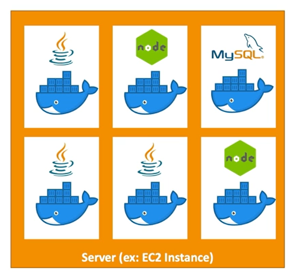
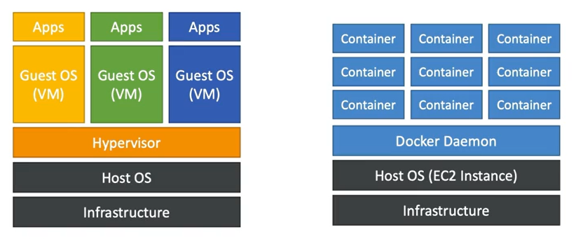

# Docker Basics

- Docker is a software development platform to deploy apps
- Apps are packaged in **containers** that can be run on **any OS**
- Apps run the same, regardless of where they are running
    - Any machine
    - No compatibility issue
    - Predictable behaviuor
    - Less work
    - Easier to maintain and deploy
    - Works with any language, any OS, any technology
- Scale containers up and down very quickly (seconds)

So the idea is that if we managed to package our application in a Docker container, then it will become very easy for us to run it on an EC2 Instance.

## Docker Repositories

Docker images are stored in Docker Repositories.

- Public: **Docker Hub**
- Private: **Amazon Elastic Container Registry (ECR)**

## Docker VS Virtual Machines

Docker is a *sort of* a virtualization technology, *but not exactly*. 

In Docker resources are shared with the host: many containers on one server.

