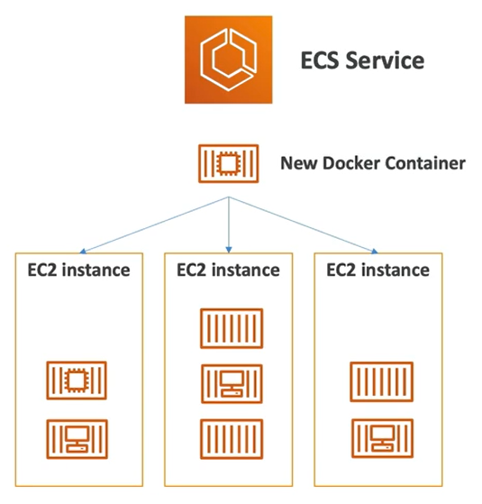

# Elastic Container Service (ECS)

- **Elastic Container Service** (ECS) is used to launch Docker containers on AWS
- You must provision and mantain the infrastructure (the EC2 instances)
- You need to create the EC2 instances **in advance**
- AWS takes care of starting/stopping the containers
- Integrated with the Application Load Balancer

