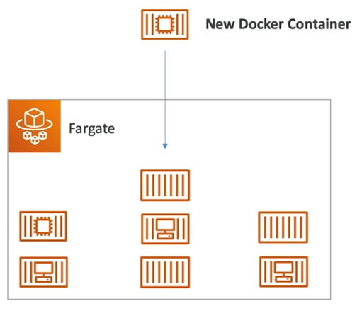

# Fargate

- **Fargate** is used to launch docker containers on AWS.
- You do **NOT** provision the infrastructure (the EC2 instances)
- **Serverless offering** (you do not manage any servers)
- AWS just runs containers for you based on the CPU / RAM you need
- Fargate is a lot simpler than ECS!

