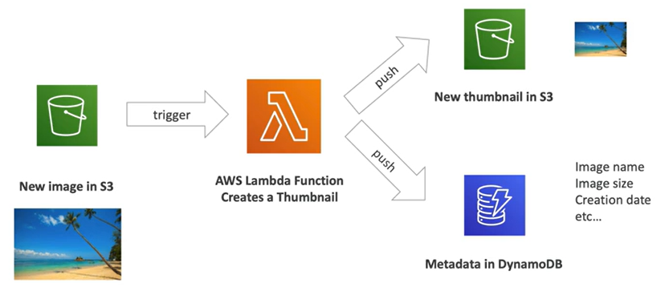
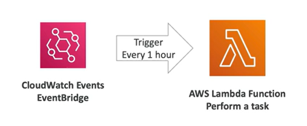

# Lambda Basics

A classic approach to run code in the cloud:
- Virtual Server in the cloud (Amazon EC2)
- Limited by RAM and CPU
- Continously running-
- Scaling means intervention to add/remove servers

With **Amazon Lambda**:
- Virtual Fuctions (no server to manage!)
- Limited by time (short executions)
- Run on-demand
- Scaling is automated

## Benefits of AWS Lambda

- **Event-Driven**: functions get invoked by AWS when needed (reactive type of service)
- Easy pricing: pay per request and compute time
- Integrated with the whole AWS suite of services
- Integrated with many programming languages
- Easy monitoring through AWS CloudWatch
- Easy to get resources per functions (up to 10 GB of RAM)
- Lambda Container Images (special Docker images you can run on Lambda)

## AWS Lambda Pricing

It is usually very cheap to run AWS Lambda, so it's very popular.

Lambda pricing is based on **calls** and **duration**.

1. Pay per calls
    - First 1M requests FREE
    - $0.20 per 1M requests
2. Pay per duration
    - 400K GB-seconds of compute time per month FREE
        - i.e. 400K seconds if function is 1 GB RAM
        - i.e. 3.2M seconds if function is 128 MB RAM
    - $1.00 for 600K GB-seconds 

## Example: Serverless Thumbnail Creation

## Example: Serverless CRON Job

