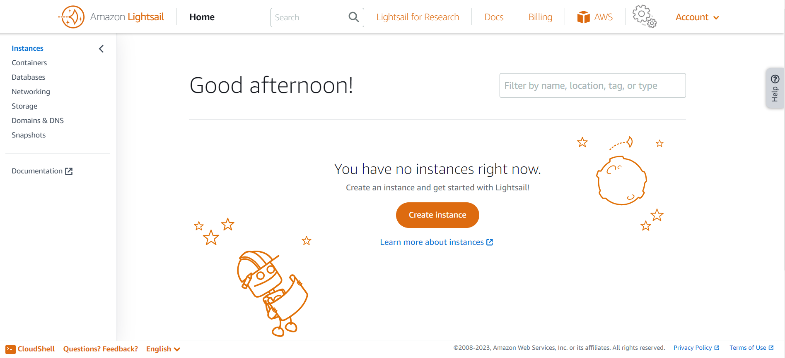

# Lightsail

- Greater for people **with little cloud experience!**
- Virtual servers, storage, databases, and networking
- Low and predictable pricing
- **Simpler alternative** to use EC2, RDS, ELB, EBS, Route 53, etc.
- Can setup notifications and monitoring of your Lightsail resoruces
- Has high availability but no auto-scaling, limited AWS integrations
- Use cases:
    - Simple web applications (templates for LAMP, Nginx, MEAN, Node.js, etc.)
    - Websites (templates for Wordpress, Magento, Plesk, Joomla)
    - Dev or Test environments
    

