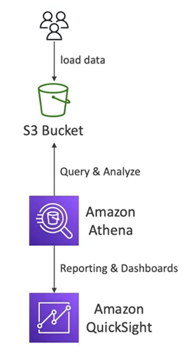

# Athena Basics

- **Serverless** query service to **perfome analytics** against S3 objects
- Use standard SQL language to query the files
- Athena is built on Presto
- Supports CSV, JSON, ORC, Avro and Parquet
- Pricing: $5.00 per TB of data scanned
- Use compressed  or columnar data for cost-savings (less scan)
- Use cases: BI, analytics, reporting, analyze $ query VPC logs, ELB logs, CloudTrail trails, etc.

