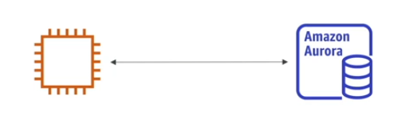
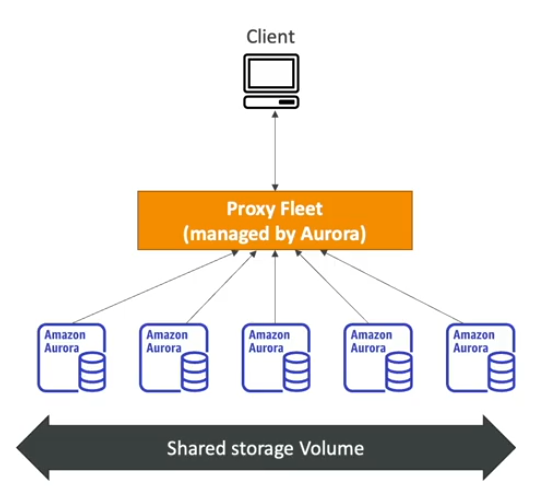

# Aurora Basics

Aurora is a **proprietary technology** from AWS (not open sourced).

Aurora supports both **PostreSQL** and **MySQL**.

Aurora is *AWS cloud optimized*"* and claims:
- 5x performance improvment over MySQL on RDS
- 3x performance improvment over Postgres on RDS

Aurora storage **automatically grows** in increments of 10GB up to 128 TB.

Aurora costs more than RDS (20% more) but is more efficient.

Aurora is not included into the free tier of AWS.

## Amazon Aurora Serverless Option

- Automated database instantiation
- Auto-Scaling based on actual usage
- Both PostreSQL and MySQL are supported
- No capacity planning needed
- Least management overhead
- Pay per second, can be more cost-effective
- Use cases: infrequent/intermittent/unpredictable workloads

