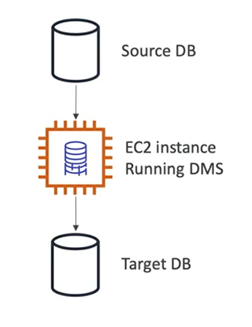

# Database Migration Service (DMS)

- Quickly and securely migrate databases to AWS, resilient, self healing
- The source database remains available during the migration
- Supports:
    - homogeneous migrations: ex Oracle to Oracle
    - heterogeneous migrations: ex Microsoft SQL Server to Aurora
    
