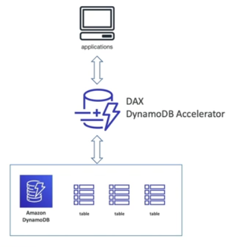
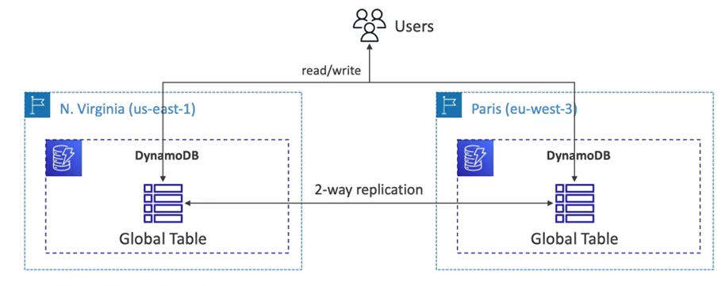

# DynamoDB

- Fully managed
- High available database (with replication across 3 AZ)
- NoSQL Database (not a relational database)
- Distributed **serverless database**
- Scale to massive workloads
- Millions of requests per seconds, trillions of row, 100s of TB storage
- Fast and consistent in performance
- Single-digit millisecond latency (low latency retrieval)
- Integrated with IAM for security, authorization and administration
- Low cost and auto-scaling capabilities
- Standard & Infrequent Access (IA) Table Class
        
**NOTE**. With RDS or with ElastiCache you need to provision a *instance type*, but with DynamoDB you don't. But there are still servers in the backend!

## DynamoDB Types of Data

DynamoDB is a key/value database.

The difference between DynamoDB and RDS is that DynamoDB will have all the data living within **one single table** and there's **no way to join** it with another table. 

We need to make sure that all the relevant data is well formatted within our main DynamoDB table.

## DynamoDB Accelerator (DAX)

- **Fully managed in-memory cache for DynamoDB**
- A cache specific for DynamoDB (it's not like ElastiCache)
- 10x performance improvment when accessing DynamoDB tables
- Micro-seconds latency
- Secure, Highly Scalable & High Available

## DynamoDB Global Tables

DynamoDB Global Tables feature make a DyanmoDB table accessibile with **low latency** in **multiple-regions**.

A global table is truly global and users can read and write to the table in any specific region, there will just be **replication between these two**.

So the fact that there is read/write access to any region of AWS on this global table, makes it an **active-active replication** because you can actively write to any region and it will actively be replicated into other regions.

