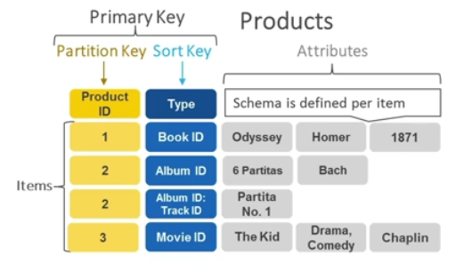
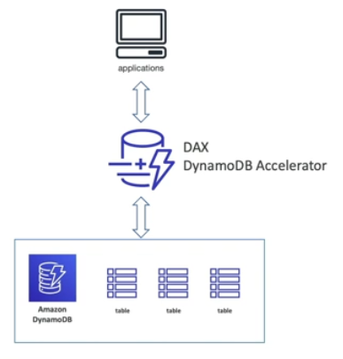

# DynamoDB Basics

- Fully managed
- High available database (with replication across 3 AZ)
- NoSQL Database (not a relational database)
- Distributed **serverless database****
- Scale to massive workloads
- Millions of requests per seconds, trillions of row, 100s of TB storage
- Fast and consistent in performance
- Single-digit millisecond latency (low latency retrieval)
- Integrated with IAM for security, authorization and administration
- Low cost and auto-scaling capabilities
- Standard & Infrequent Access (IA) Table Class
        
** With RDS or with ElastiCache you need to provision a *instance type*, but with DynamoDB you don't. But there are still servers in the backend!

## DynamoDB Types of Data

DynamoDB is a key/value database.

## DynamoDB Accelerator (DAX)

- Fully managed in-memory cache for DynamoDB
- A cache specific for DynamoDB (it's not like ElastiCache)
- 10x performance improvment when accessing DynamoDB tables
- Micro-seconds latency
- Secure, Highly Scalable & High Available

