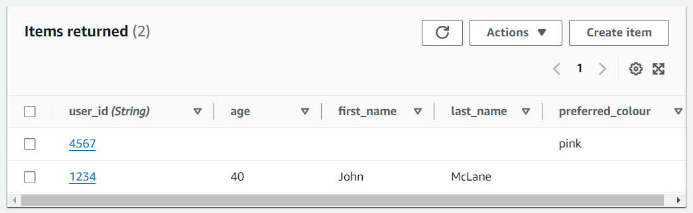
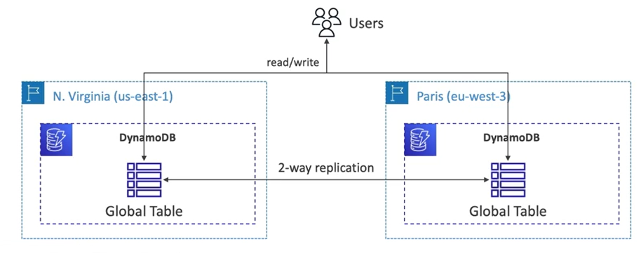

# DynamoDB Basics

- Fully managed
- High available database (with replication across 3 AZ)
- NoSQL Database (not a relational database)
- Distributed **serverless database****
- Scale to massive workloads
- Millions of requests per seconds, trillions of row, 100s of TB storage
- Fast and consistent in performance
- Single-digit millisecond latency (low latency retrieval)
- Integrated with IAM for security, authorization and administration
- Low cost and auto-scaling capabilities
- Standard & Infrequent Access (IA) Table Class
        
** With RDS or with ElastiCache you need to provision a *instance type*, but with DynamoDB you don't. But there are still servers in the backend!

## DynamoDB Types of Data

DynamoDB is a key/value database.

The difference between DynamoDB and RDS is that DynamoDB will have all the data living within one single table and there's no way to join it with another table. So we need to make sure that all the relevant data is well formatted within our main DynamoDB table.

## DynamoDB Accelerator (DAX)

- Fully managed in-memory cache for DynamoDB
- A cache specific for DynamoDB (it's not like ElastiCache)
- 10x performance improvment when accessing DynamoDB tables
- Micro-seconds latency
- Secure, Highly Scalable & High Available

## DynamoDB Global Tables

DynamoDB Global Tables feature make a DyanmoDB table accessibile with **low latency** in multiple-regions.

A global table is truly global and users can read and write to the table in any specific region, there will just be replication between these two.

So the fact that there is read/write access to any region of AWS on this global table, makes it an **active-active replication** because you can actively write to any region and it will actively be replicated into other regions.

