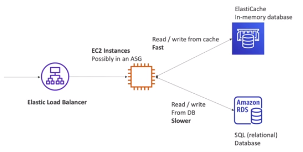

# ElastiCache Basics

The same way RDS is to get managed relational databases, **ElastiCache** is to get managed Redis or Memcached.

Caches are **in-memory databases** with high performance and low latency.

ElastiCache reduce load off databases for read intensive workloads.

AWS takes care of OS maintenance/patching, optimizations, setup, configuration, monitoring, failure recovery and backups.

