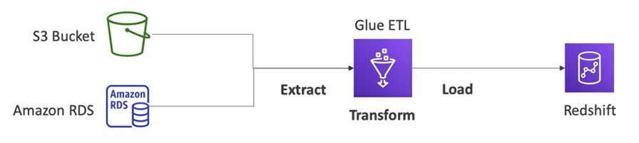

# Glue Basics

- Managed **extract-transform-load (ETL)** service
- Useful to prepare and transform data for analytics
- Fully **serverless** service

## Glue Data Catalog

The Glue Data Catalog, as the name indicates, is a catalog of your datasets in your infrastructure.

The Glue Data Catalog will have an alert reference of everything: the column names, the field names, the field types, etc.

It can be used by services such as Athena, Redshift and EMR to discover the datasets and build the proper schemas for them.