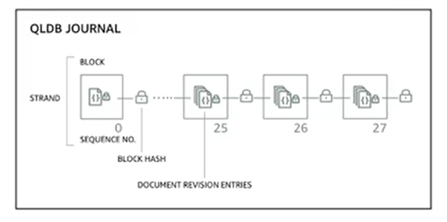

# QLDB

- QLDB stands for **Quantum Ledger Database**
- A ledger is a book **recording financial transactions**
- Fully managed, serverless, high available, replication across 3 AZ
- Used to review history of all the changes made to your application data over time
- **Immutable systems**: no  entry ca be removed or modified, cryptographically verifiable
- 2-3x performance than common ledger blockchain frameworks 
- Manipulate data using SQL

**NOTE**. The difference with AWS Managed Blockchain is that with QLDB there is **no decentralization component** in accordance with financial regulation rules.

