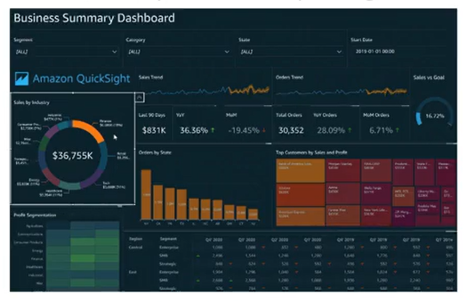

# QuickSight Basics

- Serveless machine learning powered **business intelligence service** to create interactive dashboards
- Fast, automatically scalable, embeddable, with per-session pricing
- Uses cases: Business analytics, building visualizations, perform ad-hoc analysis, get business insights using data, etc.
- Integrated with RDS, Aurora, Athena, Redshift, S3, etc.

