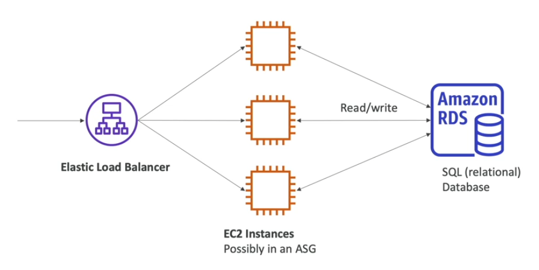

# RDS

RDS stands for **Relational Database Service**.

RDS is a managed database service for DB that will use SQL as a query language.

RDS allows you to create different relational databases:
- PostgreSQL
- MySQL
- MariaDB
- Oracle
- Microsoft SQL Server
- Aurora (AWS Proprietary Database)

## RDS Benefits

RDS is a managed service:
- Automated provisioning
- Operating System patching
- Continuous backups and restore to specific timestamp (Point in Time Restore)
- Monitoring dashboards
- Read replicas for improved read performance
- Multi AZ setup for Disaster Recovery (DR)
- Maintenance windows for upgrades
- Scaling capability (vertical and horizontal)
- Storage backed by EBS (gp2 or io1 type volume)

**NOTE**. You can't SSH into your instances.

## RDS Solution Architecture

