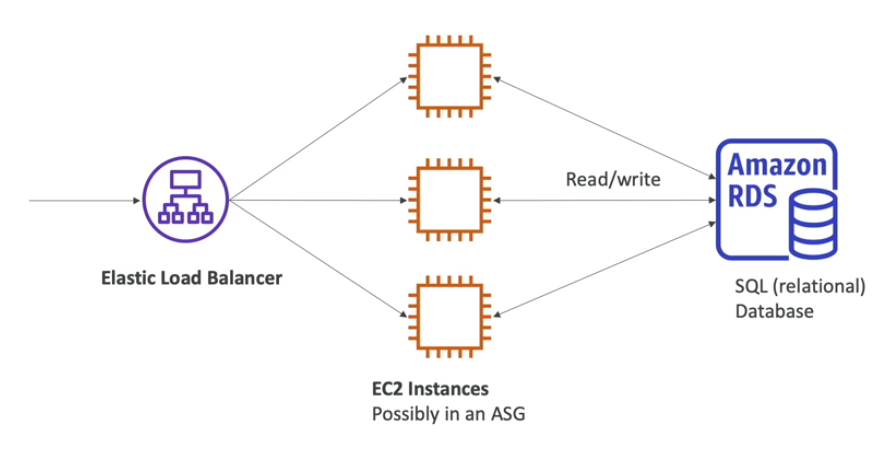

# RDS Basics

RDS stands for **Relational Database Service**.

RDS is a managed DB service for DB that will use SQL as a query language

RDS allows you to create different relational databases:
- Postgres
- MySQL
- MariaDB
- Oracle
- Microsoft SQL Server
- Aurora (AWS Proprietary Database)

## Advantage over using RDS versus deploying DB on EC2

RDS is a managed service:
- automated provisioning, OS patching
- continuous backups and restore to specific timestamp (Point in Time Restore)
- monitoring dashboards
- read replicas for improved read performance
- multi AZ setup for Disaster Recovery (DR)
- maintenance windows for upgrades
- scaling capability (vertical and horizontal)
- storage backed by EBS (gp2 or io1 type volume)

**NOTE**. Youn can't SSH into your instances.

## RDS Solution Architecture

