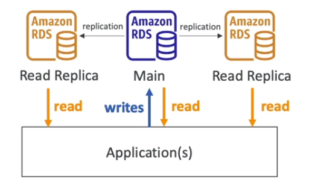
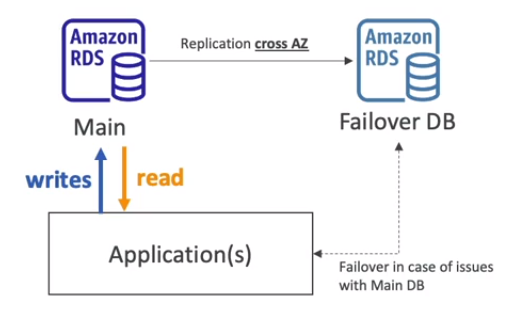
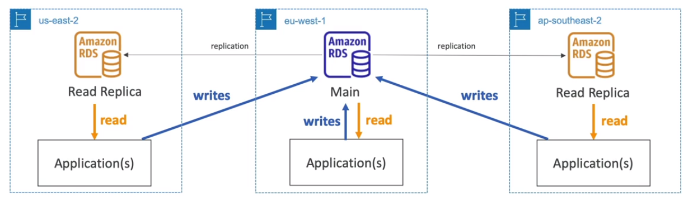

# RDS Deployment Options

Three deployment options:
1. Read Replicas
2. Multi AZ
3. Multi Region

## Read Replicas

- Scale the read workload of your DB
- Can create up to 15 Read Replicas
- Data is only written to the main DB

## Multi AZ

- Failover in case of AZ outage (hig availability)
- Data in only read/written to the main database
- Can have **only one other AZ** as failover

## Multi Region (Read Replica)

- Disaster Recovery in case of region issue
- Local performance for global reads
- Replication costs

