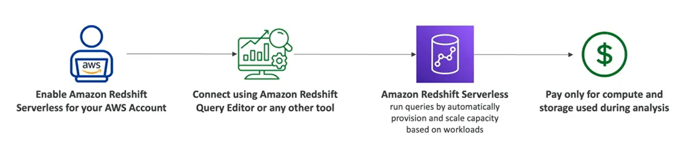

# Redshift

- Based on PostreSQL
- It is OLAP (analytics and data warehousing)
- **Columnar storage** of data (instead of row based)
- Load data once every hour, not every second
- **10x better performance** than other data warehousing, scale to PBs of data
- Massively Parallel Query Execution (MPP) engine, high available
- Pay-as-you-go based on the instaces provisioned
- Has a SQL interface for performing the queries
- Integrated with BI tools (AWS Quicksight or Tableau)

## Redshift Serverless

- Automatically provisions and scales data warehouse underlying capacity
- Run analytics workloads without managing data warehouse infrastructure
- Pay only for what you use (save costs)
- Use cases: reporting, dashboarding applications, real-time analytics, etc.

