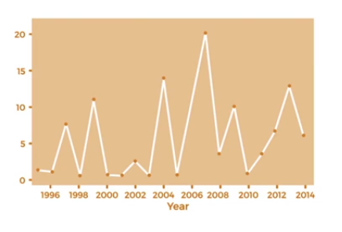

# Timestream

- Fully managed, fast, scalable, serverless **time series database** (data evolving over time)
- Automatically scales up/down to adjust capacity
- Store and analyze trillions of events per day
- 1000s times faster & 1/10th the cost of relational databases
- Built-in time series analytics functions (helps you identify patterns in your data in near real-time)

