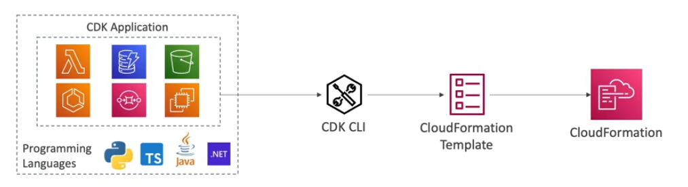
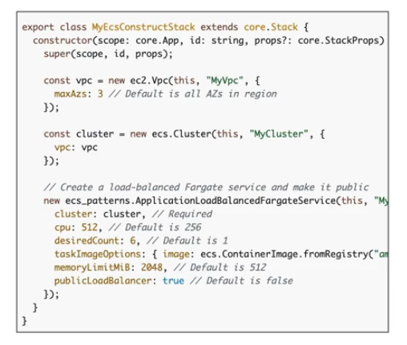

# Cloud Development Kit (CDK) Basics

- **Cloud Development Kit (CDK)** is a way to define cloud infrastructure using a familiar programming language like JavaScript, Python, Java, etc.

- The code is **traslated** into a CloudFormation template (JSON or YAML). 

- You can therefore deploy infrastructure and application runtime code toghether.
    - Great for Lambda Functions
    - Great for Docker containers in ECS/EKS

The benefits of using a programming language are:
- type safety
- code constructs (e.g. loops, collections, etc.)
- code reusability
- etc.

## CDK Example

