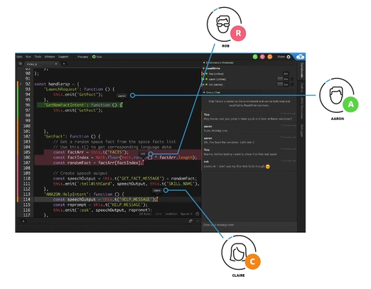

# Cloud9 Basics

A cloud IDE can be used within a web browser, meaning you can work on your project from you office, home, or anywhere with internet with no setup necessary.

**AWS Cloud9** is a cloud IDE for writing, running and debugging code.

**AWS Cloud9** also allows for code collaboration in real-time (pair programming).

