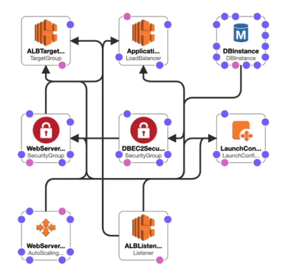

# CloudFormation Basics

CloudFormation is a declarative way of outlining your AWS Infrastructure for any resources (most of them are supported).

Example:
- I want a Security Group
- I want two EC2 instances using this security group
- I want an S3 bucket
- I want a load balancer (ELB) in front of these machines

The CloudFormation creates thos for you, in **the right order**, with **the exact configuration** that you specify.

CloudFormation is **free of use**, but you do pay for the resources created.

## Benefits of AWS CloudFormation

- **Infrastructure as Code**
    - No resources are manually created, which is excellent for control
    - Changes to the infrastructure are reviewed through code
- **Cost**
    - Each resources within the stack is tagged with an identifier so you can easily see how mich a stack costs you
    - You can estimate the costs of your resources using the CloudFormation template
    - Saving strategy: in DEV, you could automate deletion of templates at 5 PM and recreated ad 8 AM safely
- **Productivity**
    - Ability to destroy and re-create an infrastructure on the cloud on-the-fly
    - Automated generation of diagram for your template
    - Declarative programming (no need to figure out ordering and orchestration)
- **Don't re-invent the wheel**
    - Leverage existing templates on the web
    - Leverage the documentation
- **Supports (almost) all AWS resources**
    - You can use "custom resources" for resources that are not supported

## CloudFormation Stack Designer

Example: WordPress CloudFormation Stack

- You can see all the resources
- You can see all the relations between the components

