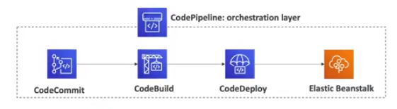

# CodePipeline

- CodePipeline **orchestrates** the different steps to have the code automatically pushed to production
    - Code > Build > Test > Provision > Deploy
    - Basics for CICD (Continuous Integration & Continuous Delivery)
- Fully managed
- Compatible with CodeCommit, CodeBuild, CodeDeploy, Elastic Beanstalk, CloudFormation, 3rd party services (GitHub, GitLab, etc..) & custom plugins
- Fast delivery & rapid updates

