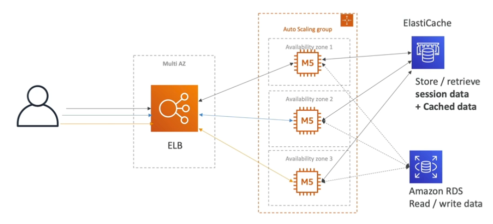

# Elastic Beanstalk

This architecture is something we can easily reproduce manually or with CloudFormation, but there is a better way.

Developer problems on AWS:

- Managing infrastructure
- Deploying code
- Scaling concerns

## Elastic Beanstalk Overview

- Elastic Beanstalk is a **developer centric** view of deploying an application on AWS
- Elastic Beanstalk is a **Platform as a Service (PaaS)**
- Elastic Beanstalk is a **managed service**
    - Instance configuration/OS is handled by Elastic Beanstalk
    - Deployment strategy is configurable but performed by Elastic Beanstalk
    - Capacity provisioning
    - Load balancing & auto-scaling
    - Application health-monitoring & responsiveness
- Three architecture models:
    - Single Instance deployment (good for dev)
    - LB + ASG: great for production or pre-production web applications
    - ASG only: great for non-web apps in productions (workers, etc.)
- Support for many platforms
    - Go, Java, PHP, Python, etc.
    - Single/Multi/Pre-Configured Docker
    - If not supported, you can write your custom platform! (advanced)

Elastic Beanstalk is **free of use**, but you do pay for the resources created.

**NOTE**. All the resources that Elastic Beanstalk wants to create are actually created behind the scenes by CloudFormation.

## Health Monitoring

Elastic Beanstalk has a full monitoring suite available within the service itself. 

Health agent pushes metrics to CloudWatch.

