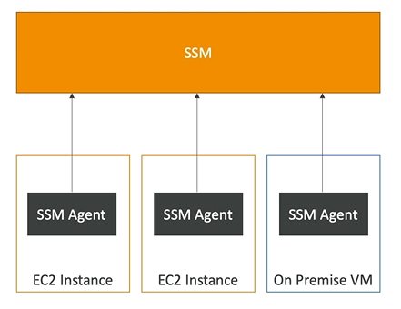

# System Manager (SSM)  

- System Manager (SSM) helps you manage your **EC2 instances and On-Premises systems** at scale
- SSM is another **hybrid service**
- SSM provides operational insights about the state of your intrastructure
- Suite of **10+ products**
- SSM most important features:
    - Patching automation for enhanced compliance
    - Run commands across an entire fleet of servers
    - Store parameter configuration with the SSM Parameter Store
- SSM Works for Linux, Windows, Mac OS and Raspberry OS (Raspbian)

## How SSM works

- Need to install **SSM agent** onto the systems to control
- SSM agent is installed by default on Amazon Linux & some Ubuntu AMI
- If an instance can't be controlled with SSM, it is probably an issue with the SSM agent
- Thanks to SSM agent,  we can **run commands, patch and configure servers**

