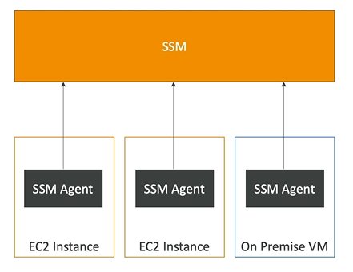
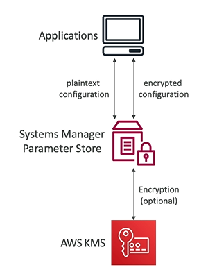

# Systems Manager (SSM)  

- Systems Manager (SSM) helps you manage your **EC2 instances and On-Premises systems** at scale
- SSM is another **hybrid service**
- SSM provides operational insights about the state of your intrastructure
- Suite of **10+ products**
- SSM most important features:
    - Patching automation for enhanced compliance
    - Run commands across an entire fleet of servers
    - Store parameter configuration with the SSM Parameter Store
- SSM Works for Linux, Windows, Mac OS and Raspberry OS (Raspbian)

## How SSM works

- Need to install **SSM agent** onto the systems to control
- SSM agent is installed by default on Amazon Linux & some Ubuntu AMI
- If an instance can't be controlled with SSM, it is probably an issue with the SSM agent
- Thanks to SSM agent,  we can **run commands, patch and configure servers**

## SSM Session Manager

- SSM Session Manager allows you to start a secure shell on your EC2 instance and on-premises servers 
- **No SSH access, bastion hosts or SSH keys needed**
- **No port 22 needed (better security)**
- It supports for Linux, Windows and Mac OS
- It can send session logs to S3 or CloudWatch Logs

So to summarize, we have three ways of accessing our EC2 instance:
1. **a terminal with SSH keys** (port 22 required)
2. **EC2 Instance Connect** (port 22 required)
3. **Session Manager + IAM role**

## SSM Parameter Store  

- SSM Parameter Store is a secure storage for configuration and secrets
    - API keys
    - passwords
    - configurations
    - etc.
- Serverless, scalable, durable, easy SDK
- Control access permissions using IAM
- Version Tracking & Encryption (optional)

