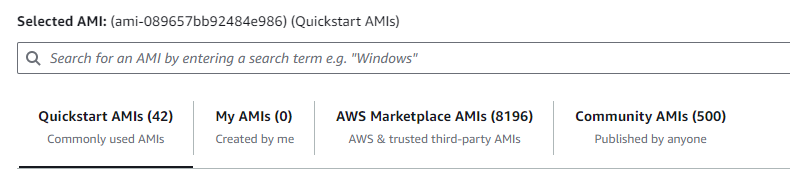
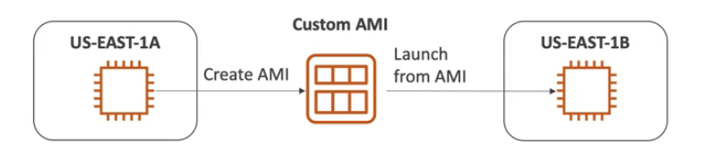

# AMI Basics

AMI stands for Amazon Machine Image. 

AMI are a **customization** on an EC2 instance:
- you add your own software, configuration, OS, monitoring
- faster boot/configuration time because all your software is pre-packaged

AMI are built for a specific region (and can be copied across regions).

You can launch EC2 instaces from:
- **a public AMI**: AWS provided (e.g. Amazon Linux 2 AMI)
- **a custom AMI**: you make and mantain them yourself
- **an AWS marketplace AMI**: an AMI someone else made (and potentially sells)

## AMI Process (from an EC2 instance)

1. Start an EC2 instance and customize it
2. Stop the instance (for data integrity)
3. Build an AMI (this will also create EBS snapshots)
4. Launch instance from other AMIs

