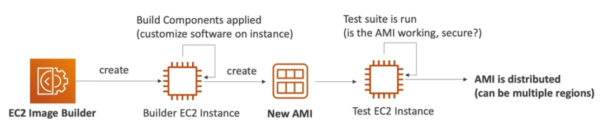

# EC2 Image Builder

- It is used to automate the creation of Virtual Machines or container images
- It automates the creation, maintain, validate and test EC2 AMIs
- It can be run on a schedule (weekly, whenever packages are updated, etc.)
- It is a **free service** (only pay for underlying resources)

