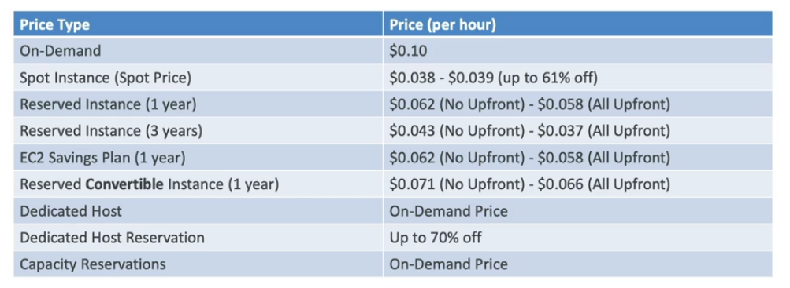

# EC2 Purchasing Options

- **On-Demand Instances**: short workload, predictable pricing
    - pay for what you use 
        - Linux or WIndows: billing per second, after first minute
        - All other operating systems: billing per hour
    - has the highest cost but no upfront payment
    - no long-term commitment
    - recommended for short-term and un-interrupted workloads, where you can't predict how the application will behave
- **Reserved Instances** (1 & 3 years)
    - **Reserved Instances**: long workloads
        instances
        - up to 72% (*may change*) discount compared to on-demand
        - you reserve a specific instance attribute (instance type, region, tenancy, OS)
        - reservation periodo: 1 year (+discount) or 3 years (+++discount)
        - payments option: no upfront (+discount), partial upfront (++discount), all upfront (+++discount)
        - reserved instance's scope: regional or zonal (AZ)
        - recommended for steady-state usage applications (e.g. database)
        - you can buy and sell in the Reserved Instance Marketplace
    - **Convertible Reserved Instances**: long workloads with flexible
        - up to 66% (*may change*) discount compared to on-demand
        - can change the EC2 instance type, instance family, OS, scope and tenancy 
- **Saving Plans** (1 & 3 years): commitment to an amount of usage, long workloads
    - get a discount based on long-term usage (up to 72% as Reserved Instances)
    - commit to a certain type of usage (€10/hour for 1 o 3 years)
    - usage beyond EC2 saving plans is billed an the on-demand price
    - locked to a specific instance family and AWS region (e.g. M5 in us-east-1)
    - flexible across:
        - instance size (e.g. m5.xlarge, m5.2xlarge)
        - OS (e.g. Linux or Windows)
        - Tenancy (Host, Dedicated, Default)
- **Spot Instances**: short workloads, cheap, can lose instances (less reliable)
    - can get a discount up to 90% (*may change*) compared to on-demand
    - instance that you can "lose" at any point of time if your max price is less than the current spot price
    - the most cost-efficient instance on AWS
    - useful for workloads that are resilient to failure
        - batch jobs
        - data analysis
        - image processing
        - any distributed workloads
        - workloads with a flexible start and end time
    - not suitable for critical jobs or database
- **Dedicated Hosts**: book an entire physical server, control instance placement
    - a physical server with EC2 instance capacity fully dedicated to your use
    - allows you address compliance requirements and use your existing server-bound software licenses (per-socket, per-core, per-VM licenses)
    - purchasing options:
        - on-demand: pay per second for active dedicated host
        - reserved: 1 or 3 years (no upfront, partial upfront, all upfront)
    - the most expensive option
    - useful for software that have complicated licensing model (BYOL - Bring Your Own License)
    - useful for companies that have strong regulatory or compliance needs
- **Dedicated Instances**: no other customers will share your hardware
    - instance run on hardware that's dedicated to you
    - may share hardware with other instances in same account
    - no control over instance placement (can move hw after stop/start)
    - **REMEMBER**: dedicated instances mean that you have your own instance on your own hardware, whereas dedicated host, you get access to the physical server itself and it gives you visibility into the lower level hardware
- **Capacity Reservations**: reserver capacity in specific AZ for any duration
    - you always have access to EC2 capacity when you need it
    - no time commitment (create/cancel anytime)
    - no billing discounts
    - you're charged at on-demand rate whether you run instances or not
    - suitable for short-tem uninterrupted workloads that needs to be in a specific AZ

## Resort Purchasing Option Analogy

- **On-Demand**: coming and staying in resort whenever we like, we pay the full price
- **Reserved**: like planning ahead and if we plan to stay for a long time, we may get a good discount
- **Saving Plans**: pay a certain amount per hour for certain period and stay in any room type (e.g king, suite, sea view)
- **Spot Instances**: the hotel allows people to bid for the empty rooms and the highest bidder keeps the rooms, you can get kicked out at any time
- **Dedicated Hosts**: we book an entire building of the resort
- **Capacity Reservations**: you book a room for a period with full price even you don't stay in it

## Price Comparison Example

