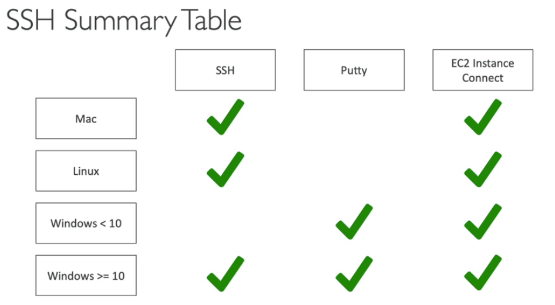

# Secure Shell

## How to connect using Linux

    > chmod 0400 <my_key_pair.pem>
    > ssh -i <my_key_pair.pem> ec2-user@<public_ip_address>

**ec2-user** is already setup for any Amazon Machine Image (AMI)

## How to connect using Windows 10+

    * change permissions on <my_key_pair.pem>
    > ssh -i <my_key_pair.pem> ec2-user@<public_ip_address>

## How to connect using Putty

1. Use **PuttyGen** to generate private key (*.ppk) from *.pem
2. Use **Putty** to connect with the generated private key 

