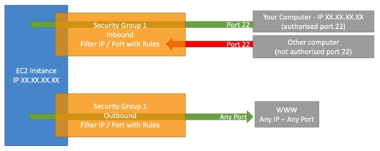
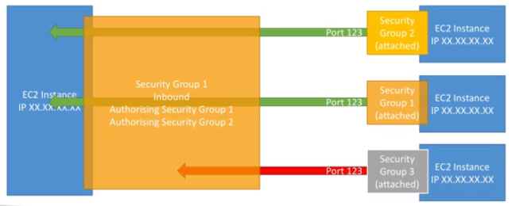

# EC2 Security Groups

Security Groups are the fundamental of network security in AWS. 

Security Groups acts as a **firewall** on EC2 instances. They control how traffic is allowed into or out EC2 instances. 

Security Groups only contain **allow** rules. These rules can be reference by IP addresses of by other security groups.

Security Groups regulate:
- access to ports
- authorized IP ranges (IPv4 or IPv6)
- control of inbound network (from other to the instance)
- control of outbound network (from the instance to other)

Security Groups (good to know):
- can be attached to multiple instances
- an instance can have multiple security groups
- locked down to a region/vpc combination
- does live "outside" the EC2 (if traffic is blocked the EC2 instance won't see it)
- it's good to maintain one separate security group for SSH access
- if your application is not accessible (time out), then it's a security group issue
- if your application gives a "connection refused" error, then it's an application error or it's not launched
- all inbound traffic is **blocked by default**
- all outbound traffic is **authorized by default**

Classic ports to know:
- 21 = FTP (File Transfer Protocol) - upload files into a file share
- 22 = SSH (Secure Shell) - log into a linux instance
- 22 = SFTP (Secure File Transfer Protocol) - upload file using SSH
- 80 = HTTP - access unsecured websites
- 443 = HTTPS - access secured websites
- 3389 = RDP (Remote Desktop Protocol) - log into a windows instance

## Security Groups Diagrams

