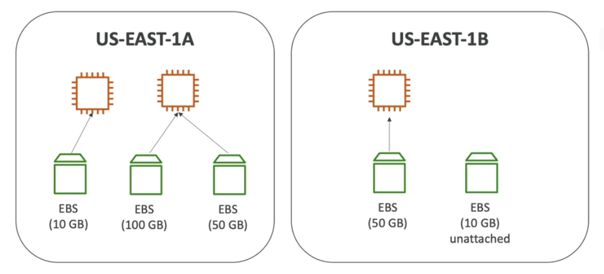

# EBS Basics

An **Elastic Block Store (EBS)** volume is a network drive you can attach to your instance while they run. It allows your instances to persists data, even after their termination. We can recreate an instance and mount to the same EBS Volume from before and we'll get back our data.

**ANALOGY**: think of EBS volumes as a "network USB stick".

EBS Volume:
- it is a network drive (i.e. not a physical drive)
    - it uses the network to communicate the instance (i.e. consider latency)
    - it can be deatched from an EC2 instance and attached to another one quickly
- it is locked to an Availability Zone (AZ)
    - an EBS volume in us-east-1a cannot be attached to eu-east-1b
    - to move a volume across, you first need to snapshot it
- it has a provisioned capacity (size in GBs and IOPs)
    - you get billed for all the provisioned capacity
    - you can increase the capacity of the drive over time

It is possibile to create EBS volumes and leave them unattached (they can be attached on demand).

## Delete on Termination Attribute

Delete on Termination attribute controls the EBS behaviour when an EC2 instance terminates.

By default:
- the root EBS volume is deleted (attribute enabled)
- any other EBS volume is not deleted (attribute disabled)

## EBS Multi-Attach Feature

EBS volumes can only be mounted to one instance at a time (at the Certified Cloud Practioner level). Each EC2 instance needs to have its own EBS volume attached to it.

## Links

- [Make an Amazon EBS volume available for use on Linux](https://docs.aws.amazon.com/AWSEC2/latest/UserGuide/ebs-using-volumes.html)

