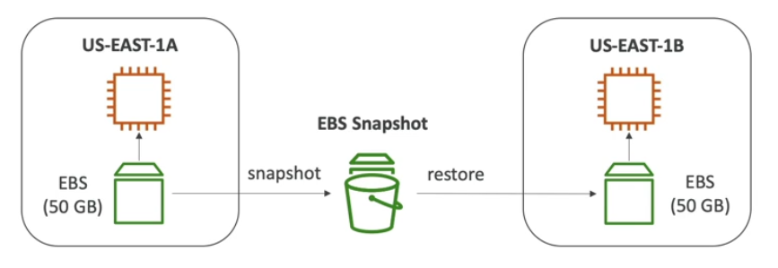
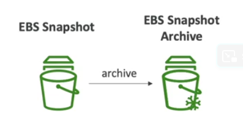
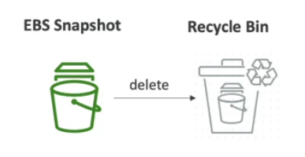

# EBS Snapshots

A snapshot is a backup of an EBS volume at a point in time. For the first snapshot of a volume, EBS saves a full copy of your data to S3. Snapshots are **stored incrementally**, which means you are billed only for the changed blocks stored.

It is not necessary to detach the volume prior to doing the backup, but **it is recommended**.

You can copy snapshots across Availability Zones or Regions in order to transfer data in a different region on AWS to leverage the global infrastructure.

## EBS Snapshot Archive

- Move a snapshot to an "archive tier" that is 74% cheaper
- Takes within 24 to 72 hours for restoring the archive

## EBS Snapshot Recycle Bin

- Setup rules to retain deleted snapshots so you can recover them after an accidental deletion
- Specify retention (from 1 day to 1 year)

