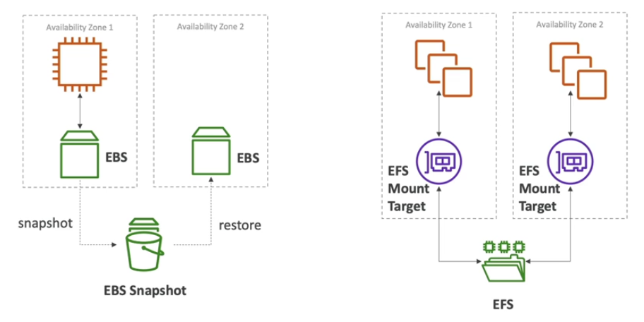
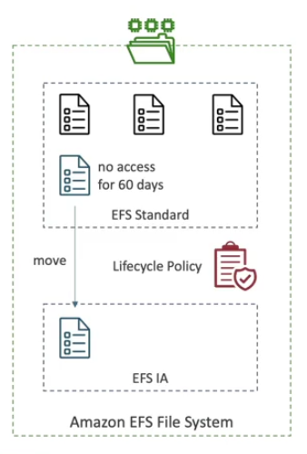

# Elastic File System (EFS)

**Elastic File System (EFS)** is a managed NFS (network file system) that can be mounted on hundreds of EC2.

EFS works **only with Linux EC2 intances in multi-AZ**. 

It is possibile from an instance in one AZ to be attaching the same EFS volume as the instance in another AZ.

EFS characteristics:
- Highly available
- Scalable
- Expensive (3x price of EBS gp2 volume)
- Pay-per-Use
- No capacity planning

## EBS vs EFS

The EBS volume can only be attached to one instance in one specific AZ because the EBS volumes are bound to specific AZs. If we wanted to move over the EBS volume from one AZ to another, we could create a snapshot and then restore that snapshot into a new availability zone. This is a **copy**, this is not an in-sync replica.

EFS is a network file system. That means that whatever is on the EFS drive is shared by everything that is mounted to it. Say we have many instances in AZ 1 on one or many instances as well on AZ 2. At the same time, all these instances can mount the same EFS drive using a mount target and they will all see the same files. So, that makes it a **shared file system**.

## EFS Infrequent Access (EFS-IA)

EFS Infrequent Access (EFS-IA) is a **storage class** that is cost-optimized for files not accessed every day.

EFS-IA is up to 90% lower cost compared to EFS Standard.

If you enable EFS-IA with a Lifecycle Policy, EFS will automatically move your files to EFS-IA based on the last time they were accessed.

EFS-IA is transparent to the applications accessing EFS.

