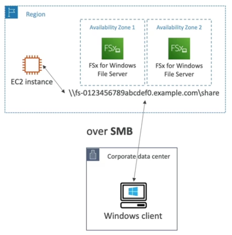

# FSx Basics

Amazon FSx is a fully managed service to get third-party high-performance file systems on AWS. So in case you don't wanna use EFS or S3, and you want something else, then you can use FSX to manage these file systems.

You have three offering today:
- FSx for Lustre
- FSx for Windows File Server
- FSx for NetApp ONTAP

## Amazon FSx for Windows File Server

- Fully managed, highly reliable, scalable Windows native shared file system
- Built on Windows File Server
- Supports SMB protocol & Windows NTFS
- Integrated with Microsoft Active Directory
- Can be accessed from AWS or your on-premise infrastructure

## Amazon FSx for Lustre

- Fully managed, high-performance, scalable file storage for HPC
- The name Lustre is derived from "Linux" and "cluster"
- Machine Learning, Analytics, Video Processing, Financial Modeling, etc.

