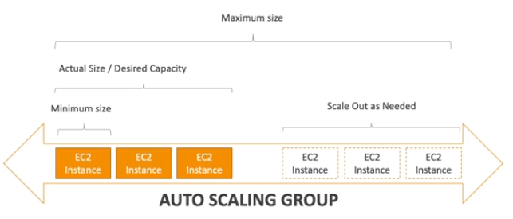
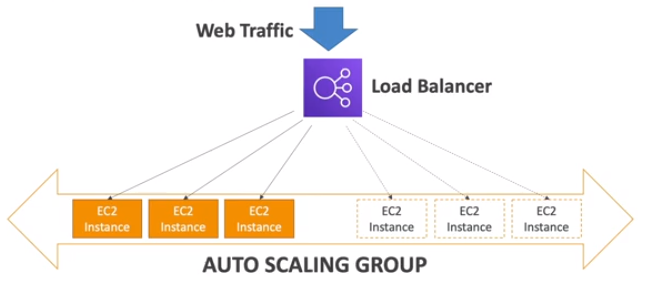

# Auto Scaling Group (ASG)

In real-life, the load on your websites and application can change.

In the cloud, you can create and get rid of servers very quickly.

The goal of an **Auto Scaling Group (ASG)** is to:
- scale out (add EC2 instances) to match an increased load
- scale in (remove EC2 instances) to match a decreased load
- ensure we have a minimum and a maximum number of machine running
- automatically register new instance to a load balancer
- replace unhealthy instances

Another benefit of ASG is **cost savings**: only run at an optimal capacity (principle of the cloud).

## ASG in AWS

The ASG can scale out/in as needed (by adding EC2 instances over time) and it work hand in hand with a load balancer.

